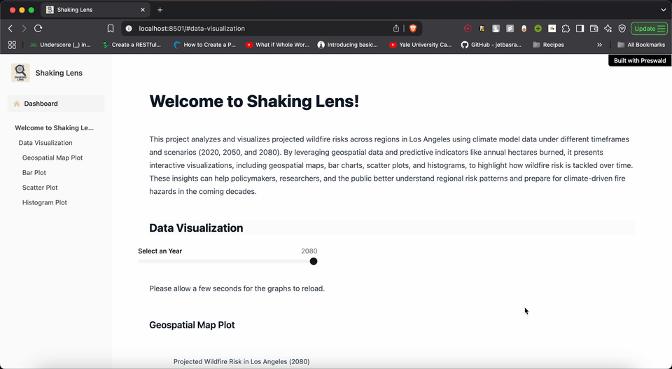

# 🔥 ShakingLens

## 🌍 Motivation

**ShakingLens** is a geospatial analytics project that analyzes and visualizes projected wildfire risks across regions in Los Angeles. The goal is to generate actionable insights to help **policymakers**, **researchers**, and the **general public** better understand evolving regional fire risks and prepare for climate-driven wildfire hazards in the coming decades.

You can access the deployed app (Render) here : https://shakinglens.onrender.com

## 🚀 Features

- 🌐 Interactive geospatial visualizations of wildfire projections  
- 📊 Real-time graph rendering for intuitive data exploration  
- 🧠 Data-driven insights to support strategic decision-making

## ⚙️ Installation

To set up the project locally:

1. Clone the repository:
    ```bash
    git clone https://github.com/ABCoder1/ShakingLens.git
    ```

2. Navigate to the project directory:
    ```bash
    cd ShakingLens
    ```

3. Create and activate a Python virtual environment:
    ```bash
    python -m venv myenv && source myenv/bin/activate
    ```

4. Install the dependencies:
    ```bash
    pip install -r requirements.txt
    ```

## 🧪 Usage

Start the Preswald application:

```bash
preswald run
```

Then visit http://localhost:8501 in your browser to explore the wildfire risk dashboard.

## 🎬 Demo


